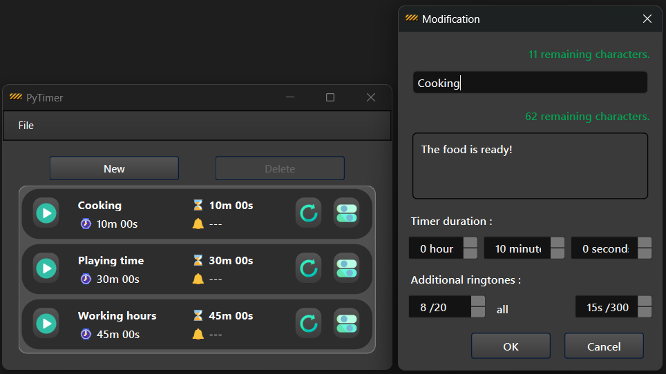

# Pytimer

## Pytimer est une application de minuteurs personnalisables.

### Description :
Pytimer vous permet de créer et de gérer plusieurs minuteurs, chacun pouvant déclencher des notifications. Vous pouvez personnaliser le message et la durée des notifications pour que les minuteurs sonnent à plusieurs reprises si nécessaire. Une fois activé, chaque minuteur affiche non seulement le temps restant, mais aussi l'heure à laquelle il devrait se terminer.


***
### Overview :



***
### Required :
- Python

***
### Installation :
Clone the repository using the following command and move inside the folder :
```bash
git clone https://github.com/Krogan77/PyTimer.git && cd PyTimer/

```

***
## Configuration
Create a virtual environment and install the required dependencies specified in the `requirements.txt` file :
```bash
python -m venv env
env\Scripts\activate
pip install -r requirements.txt
```

***
## Use
To launch the application, run the `run.sh` file :
#### (from the root folder)
```bash
. run.sh
```
You can also launch this file `run.sh` from any location to start the application.


### Crédits :
Icons by : 
https://icons8.com